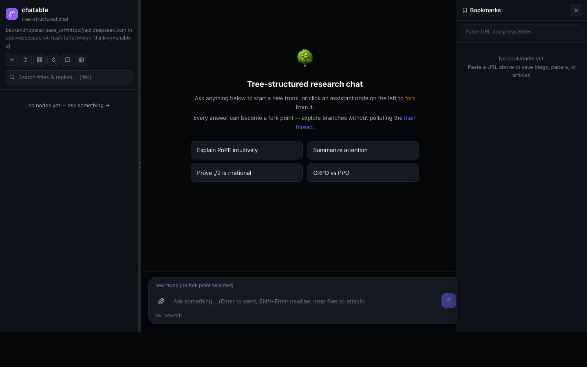

# chatable

[](LICENSE)
[](https://github.com/weixuansun/chatable/actions/workflows/ci.yml)

A tree-structured research chat web UI for paper and blog reading with LLMs.
Ask a question at any point, fork the conversation, and come back to a mind
map of where you've been.

It's built for paper/blog reading, math/proof discussion, and algorithm idea
exploration — workflows that a linear chat UI handles poorly:

- **Natural mind map.** Your conversation is already a tree, so you get a
  visual overview of your reading for free.
- **Context pollution.** Later turns can derail the context; jump back to any
  earlier definition, claim, or answer instead of scrolling and re-explaining.
- **Fork from anywhere.** Any message can be a fork point — ask a side
  question about a single sentence without touching the main-line context.
- **Cheaper context.** Forking reuses the shared prefix instead of repeating
  it, saving context length (and staying cache-friendly).
- **Private by default.** It runs against your own LLM API key and stores
  everything on your local filesystem — nothing is uploaded to any
  third-party service.



## Installation

Requires Python 3.10+.

```bash
pip install -e .
```

## Usage

Set your API key and start the web server:

```bash
DEEPSEEK_API_KEY=sk-... chatable-web
# then open http://127.0.0.1:8000
```

- Click an assistant node in the tree pane to fork the conversation from that
  point.
- Conversation state is persisted as JSONL under `~/.chatable`; pass
  `--data-dir <path>` to keep history in a specific folder.
- Common overrides via environment variables: `DEEPSEEK_BASE_URL`,
  `DEEPSEEK_MODEL`, `TAVILY_API_KEY` (web search), `CHATTABLE_WEB_HOST` /
  `CHATTABLE_WEB_PORT` (bind address), and more — the in-app settings panel
  covers model, base URL, API key, and storage folder.

## License

[Apache License 2.0](LICENSE)
