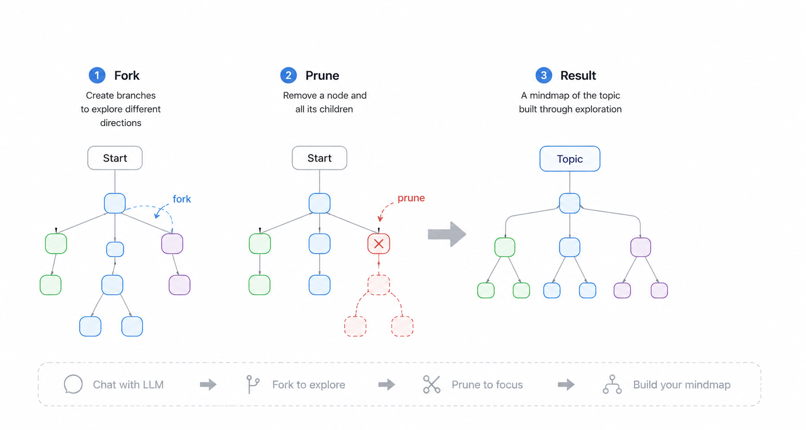
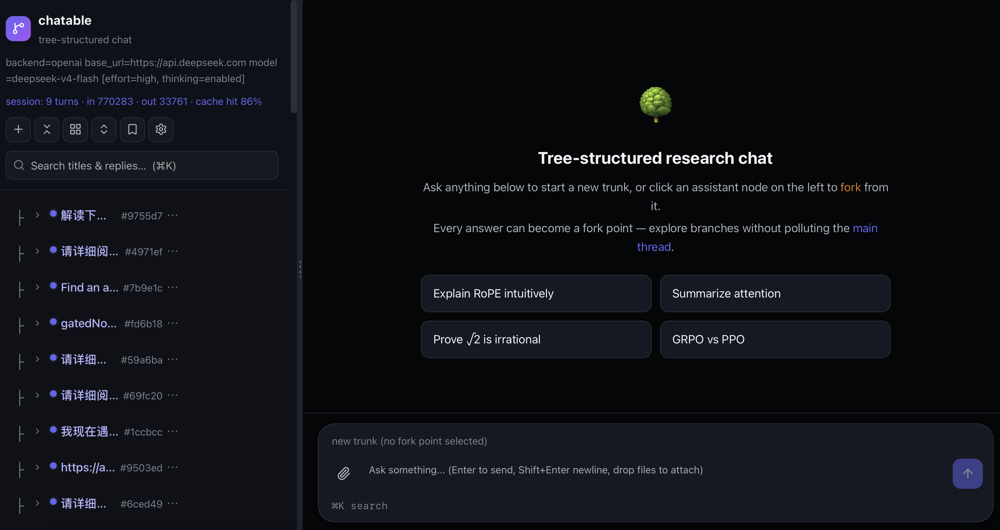
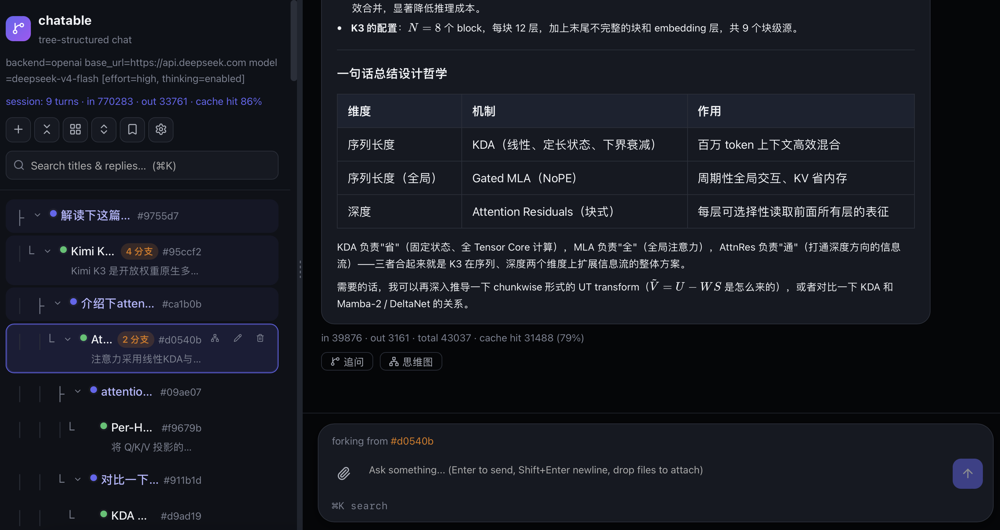
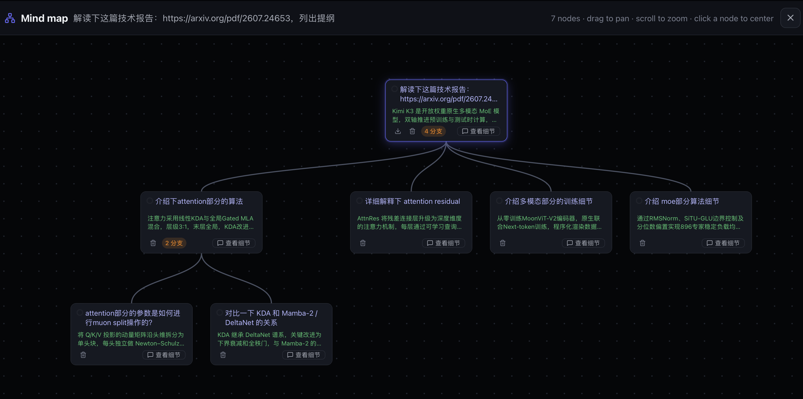

# chatable

[](LICENSE)
[](https://github.com/weixuansun/chatable/actions/workflows/ci.yml)



A tree-structured research chat web UI for paper and blog reading with LLMs.
Ask a question at any point, fork the conversation, and come back to a mind
map of where you've been.
When you talk to LLM, not all context is neccesary, you can control your context 
by forking at any conversation turn.

It's built for paper/blog reading, math/proof discussion, and algorithm idea
exploration — workflows that have:

- **Natural mind map.** Your conversation is already a tree, so you get a
visual overview of your reading for free.
- **No Context pollution.** Later turns can derail the context; jump back to any
earlier definition, claim, or answer instead of scrolling and re-explaining.
- **Fork from anywhere.** Any message can be a fork point — ask a side
question about a single sentence without touching the main-line context.
- **Cheaper context.** Forking reuses the shared prefix instead of repeating
it, saving context length (and staying cache-friendly).
- **Private by default.** It runs against your own LLM API key and stores
everything on your local filesystem — nothing is uploaded to any
third-party service.
- **Configurable in the browser.** Model, base URL, and API key can be
switched from the settings panel without restarting, and the UI appearance
(theme color, font size) is adjustable too.
- **Bookmarks / read-it-later.** Save URLs (blogs, papers, articles) in the
bookmark sidebar; the server fetches a title and summary, and you can start
a chat from any bookmark to discuss it with the model.


## Screenshots

**Start screen** — pick a suggested prompt or ask anything to open a new trunk.



**Tree + chat** — the conversation tree on the left; click any assistant node to fork a new branch from it.



**Mind map** — the whole conversation tree as an interactive map.



## Installation

Requires Python 3.10+.

```bash
pip install -e .
```


## Usage

Set your API key and start the web server:

```bash
DEEPSEEK_API_KEY=sk-... chatable-web
# then open http://127.0.0.1:8000
```

- Click an assistant node in the tree pane to fork the conversation from that
point.
- Conversation state is persisted as JSONL under `~/.chatable`; pass
`--data-dir <path>` to keep history in a specific folder.
- Common overrides via environment variables: `DEEPSEEK_BASE_URL`,
`DEEPSEEK_MODEL`, `CHATTABLE_WEB_HOST` / `CHATTABLE_WEB_PORT` (bind address),
and more — the in-app settings panel covers model, base URL, API key, and
storage folder.

### Web search (optional)

Automatic `web_search` works out of the box via DuckDuckGo (free, no key).
For higher-quality results, add one or both provider keys — they are tried in
the order **Tavily → Exa → DuckDuckGo**, falling back on failure:

```bash
TAVILY_API_KEY=tvly-... EXA_API_KEY=... chatable-web
```

- `TAVILY_API_KEY` — create a key at [tavily.com](https://tavily.com);
  the free tier includes 1,000 searches/month.
- `EXA_API_KEY` — create a key at [exa.ai](https://exa.ai);
  the free tier adds $10 of credits every month (no card required).

Both are read from the environment at request time, so exporting them in your
shell rc file (e.g. `~/.zshrc`) also works.


## License

[Apache License 2.0](LICENSE)
