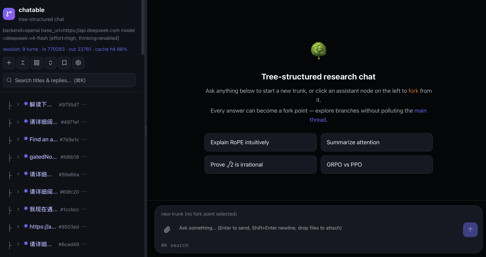

# chatable

[](LICENSE)
[](https://github.com/weixuansun/chatable/actions/workflows/ci.yml)


一个问题，让 AI 同时试几种做法，比一比再挑最好的那个。agent 的改动在你点“采用”之前都在独立副本里，采用之后也能撤销。

chatable 是一个树状的 AI 对话工具：每条消息是一个节点，可以从任意节点续问或分叉，几条思路同时往下走，互不干扰。每个节点同时记住对话和代码快照。

## 它解决什么问题

- **对话只能一条线走**：想换个思路，要么新开对话丢掉上下文，要么把原对话搞乱。
- **没法同时试几种方案、几个 agent**：通常一次只跑一种做法，不满意就推倒重来。
- **聊清楚的方案还要手动搬给 agent**：网页上讨论完，再复制粘贴到 Claude Code 里。
- **agent 直接改真实项目**：改坏了要自己 `git stash`、`git reset`，难以回退。
- **几次尝试难比较、难合并**：各对一半的结果只能手动对 diff。
- **回不到中间状态**：回到第 5 轮对话时，代码已经是第 10 轮的样子。

## 怎么用

每个节点有两种模式：

- **对话**：只读，可以上网，用来提问和查资料。
- **交给 agent**：在从父节点快照检出的独立目录里读代码、改代码、跑命令。前面整条分支的讨论会自动写成上下文文件交给 agent。一次可以派给多个 agent，每个各跑一支分支。

跑完的结果存成节点快照。不同分支可以比较、合并，有冲突时会自动派 agent 解决。挑中一个之后点“采用”，改动才会写入你的项目，随时可以撤销。

## 当前状态

原型阶段，单机本地运行，代码在 `orchestrator` 分支。

- 已完成：树状对话、两种模式、多 agent 并行、节点快照、合并与采用、沙箱（Linux 上用 bwrap，默认不联网）。
- 内置 agent（DeepSeek）已验证；Claude Code、Codex、Kimi Code 已接入，尚未完整实测。
- 已知限制：Mac 上的 Seatbelt 沙箱未实测；外部 CLI 尚未套沙箱；旧运行目录不会自动清理。

## Screenshots

**Start screen** — pick a suggested prompt or ask anything to open a new trunk.



**Tree + chat** — the conversation tree on the left; click any assistant node to fork a new branch from it.


**Mind map** — the whole conversation tree as an interactive map.


## Installation

Requires Python 3.10+. Dependencies are declared in `pyproject.toml`
(`requirements.txt` is just a `-e .` shim over it).

```bash
pip install -e .
```

For development (runs the test suite from the repo root):

```bash
pip install -e ".[dev]"
pytest
```


## Usage

Set your API key and start the web server:

```bash
DEEPSEEK_API_KEY=sk-... chatable-web
# then open http://127.0.0.1:8000
```

- Click an assistant node in the tree pane to fork the conversation from that
point.
- Conversation state is persisted as JSONL under `~/.chatable`; pass
`--data-dir <path>` to keep history in a specific folder.
- Common overrides via environment variables: `DEEPSEEK_BASE_URL`,
`DEEPSEEK_MODEL`, `CHATTABLE_WEB_HOST` / `CHATTABLE_WEB_PORT` (bind address),
and more — the in-app settings panel covers model, base URL, API key, and
storage folder.
- The agent project directory (the workspace 「交给 agent」 runs in) is chosen
in the same settings panel (项目目录); it defaults to `<data-dir>/workspace`
and `CHATTABLE_WORKSPACE` still overrides it when set.

### Exposing the server (optional)

By default the server only accepts requests whose `Host` header is localhost,
`127.0.0.1` or `[::1]` (plus the bind host from `--host` /
`CHATTABLE_WEB_HOST`), and rejects cross-origin writes — so other devices and
web pages you visit cannot reach your chats. If you deliberately serve beyond
localhost:

- `CHATTABLE_ALLOWED_HOSTS` — comma-separated extra hostnames to accept
  (e.g. `CHATTABLE_ALLOWED_HOSTS=chat.lan,myhost`). **Required** when binding
  to `0.0.0.0` / `::` or a LAN address: requests arriving with this machine's
  LAN IP or hostname are otherwise rejected with 400.
- `CHATTABLE_AUTH_TOKEN` — require this token for every request. Open
  `http://<host>:<port>/?token=<token>` once to set the login cookie;
  scripts can use `Authorization: Bearer <token>`.
  Binding to a non-loopback address without a token prints a loud warning.

(The single-T spellings `CHATABLE_ALLOWED_HOSTS` / `CHATABLE_AUTH_TOKEN` are
accepted as aliases.)

### Web search (optional)

Automatic `web_search` works out of the box via DuckDuckGo (free, no key).
For higher-quality results, add one or both provider keys — they are tried in
the order **Tavily → Exa → DuckDuckGo**, falling back on failure:

```bash
TAVILY_API_KEY=tvly-... EXA_API_KEY=... chatable-web
```

- `TAVILY_API_KEY` — create a key at [tavily.com](https://tavily.com);
  the free tier includes 1,000 searches/month.
- `EXA_API_KEY` — create a key at [exa.ai](https://exa.ai);
  the free tier adds $10 of credits every month (no card required).

Both are read from the environment at request time, so exporting them in your
shell rc file (e.g. `~/.zshrc`) also works.

`web_fetch` refuses non-public addresses (SSRF guard). If you run a TUN-mode
proxy (Clash/Mihomo "fake-IP"), hostnames resolve into 198.18.0.0/15 — that
range is allowed by default so fetches keep working. Override with
`CHATTABLE_FETCH_ALLOW_NETS` (comma-separated CIDRs, e.g. to allow an
intranet range; set it empty to disable the default).

### 交给 agent: external coding agents in the conversation tree

One switch above the composer decides what a message does:

- **对话** — a normal chatable reply; nothing touches your files.
- **交给 agent** — the message is an instruction for a coding agent
  (built-in DeepSeek agent, Kimi Code, Claude Code or Codex; pick one or
  several — several = race the same instruction). It runs in an isolated git
  worktree from the current node's file snapshot, its steps stream into the
  main chat, and the result becomes a normal reply node with status, files
  changed and test result. The real workspace changes only when you click
  **采用 (Adopt)**.

After sending, the composer stays on the same node, so sending another
instruction starts a parallel task; the 「从这里发出的 agent 任务」 list under
the conversation shows each one's live status (查看 / 取消). In the mind
map, run cards show the agent and status; **Shift+click** (or the ☐ button)
two or more cards with snapshots to **合并** (3-way merge under their common
ancestor; conflicts or new test failures are handed to a resolver agent
automatically) or **对比**. The agent's context (`.chatable/CONTEXT.md`) is
built from the conversation path. API: see "Agent runs in the conversation"
in [docs/agent-api.md](docs/agent-api.md); design notes in
[docs/orchestrator-design.md](docs/orchestrator-design.md).

- Executors are auto-detected (`CHATTABLE_KIMI_BIN` / `CHATTABLE_CLAUDE_BIN`
  / `CHATTABLE_CODEX_BIN` to override); unavailable ones show greyed out.
- Per-agent concurrency: `CHATTABLE_ORCH_LIMITS` (default
  `kimi=2,claude=2,codex=2,builtin=3`). Run/test timeouts:
  `CHATTABLE_ORCH_RUN_TIMEOUT_S` (1800), `CHATTABLE_ORCH_TEST_TIMEOUT_S` (300).
- No access token needed on the default localhost bind; when serving beyond
  localhost, agent runs require `CHATTABLE_AUTH_TOKEN`.
- Sandboxing: `builtin` runs use the agent shell sandbox (bwrap on Linux,
  Seatbelt on macOS) confined to the run's worktree. External CLIs (kimi,
  claude, codex) are **not** wrapped — they need network to their APIs and
  use their own permission modes; they are isolated only by running in a
  throwaway worktree (the real workspace changes only on Adopt).

## License

[Apache License 2.0](LICENSE)
